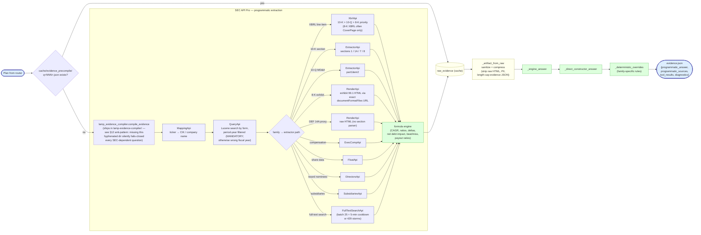

# Metasystem Harness Guidebook

Status: canonical operator and implementation guide for the finance metasystem harness

Audience:
1. any agent designing or repairing a metasystem harness for finance workflows
2. any agent wiring a model into a benchmark-facing or production agentic workflow
3. any agent touching routing, evidence compilation, candidate generation, verification, or final-answer submission

Last updated: 2026-04-23 (hardening + vLLM canonicalization + red-team validation added)

Sibling canonical docs (read these together with this one — all live in THIS repo under `docs/`):

1. `docs/runpod_serverless_setup_guide_v2.md` — serverless deployment, cold-start reality, scaler behavior, security hardening at the endpoint layer.
2. `docs/RED_TEAM_HANDOVER.md` — independent-auditor instruction set; the prohibited-string inventory that the harness MUST NOT emit.
3. `docs/SYNTHETIC_VALS_QUESTIONS_V1.md` — 50 forward-looking questions the harness must generalize to.

Reference implementation of everything in this guide: [`github.com/james47kjv/lamp1`](https://github.com/james47kjv/lamp1). Validated 2026-04-23 at 45/50 strict pass on the full Vals benchmark and 0 leaks / 0 scope violations / 0 injection successes across 68 adversarial probes.

**Verification rule.** Any claim in this doc about what the code does must cite a specific file and function. When code and doc disagree, the code is truth and the doc is the bug. The assurance-agent pass on 2026-04-23 caught this exact failure mode: the doc had previously claimed the live public endpoint ran `execute_search_profile` when the code ran only `solver_b1` + fallback; §3 of this doc now reflects the actual narrow public path AND the aspirational full-metasystem path separately.

## 1. Purpose

This is the canonical guide for how the metasystem harness should be designed, implemented, and operated in this repo.

The purpose of this document is the same as the RunPod serverless guide:

1. define the one canonical approach
2. record the implementation lessons that were expensive to learn
3. prevent future agents from reviving broken patterns
4. distinguish architecture that is useful in research from architecture that is safe in production

This guide is not a historical PRD. It is an implementation guide based on what now exists in code and what failed during live rollout.

## 1A. Things To Watch Out For

These are the harness mistakes most likely to hurt benchmark or production behavior:

1. Do not let the first non-empty answer win by default. Candidate selection is as important as candidate generation.
2. Do not let the model extract raw filing data from large HTML blobs. Python must extract first; the model reasons over compressed structured evidence.
3. Do not let the model rewrite an already valid deterministic candidate just because a finalizer stage exists. If the selected candidate already passes contract and verification, preserve it and skip the rewrite.
4. Do not restore historical replay, canned issuer strings, or best-of-all-runs helpers anywhere in the live path.
5. Do not drop `q_num`, entity resolution, period, source provenance, or verification artifacts as the request moves through the harness.
6. Do not add silent retries, hidden fallback precedence, or unexplained side paths. If the harness changes answer semantics, that change must be explicit in code and docs.
7. Do not reintroduce split-backend routing through model-base-url overrides. The canonical runtime is single-endpoint and same-container.
8. Do not route multi-quarter guidance-range questions into `beat_miss_guidance`. The correct existing lane is `financial_modeling_projections` with `guidance_range_formatted`.
9. Do not strip answer-contract metadata before final formatting. q004-style guidance tables need `expected_shape=quarter_guidance_lines` and the preserved period order at the public formatter.

## 2. Canonical Definitions

### 2.1 What the metasystem harness is

The metasystem harness is the control layer around the model.

It decides:

1. how a question is routed
2. how evidence is compiled before any reasoning step
3. how candidate answers are generated
4. how those candidates are checked, challenged, repaired, or rejected
5. how the final answer is emitted in the exact external contract

### 2.2 What the metasystem harness is not

It is not:

1. raw prompt stuffing
2. a second name for the model
3. a pile of fallback scripts with unclear precedence
4. a license to add unbounded loops or silent retries
5. a replacement for the evidence compiler

### 2.3 Core components in this repo

The current finance metasystem stack is split across these responsibilities:

1. `finance_router.py`: family and plan generation
2. `adapters/evidence_compiler.py`: structured evidence compilation and candidate selection
3. `adapters/solver_b1.py`: deterministic lane formatting and validation
4. `adapters/solver_b2.py`, `adapters/challenger.py`, `adapters/critic.py`, `adapters/reviser.py`, `adapters/arbiter.py`: model-backed reasoning and review adapters
5. `metasystem_harness.py`: budgeted orchestration, workspaces, verification, traces, and policy memory
6. `services/finance-endpoint/app.py`: public OpenAI-style endpoint wrapper

## 3. The Three Allowed Runtime Shapes

One of the biggest sources of drift was mixing a research harness with the live public path and treating them as the same thing. They are related but they are not interchangeable.

As of the 2026-04-23 rebuild there are now three shapes, not two. The new propose-review-judge *agent runtime* (§3.3) sits between the narrow benchmark-safe path (§3.2) and the full metasystem loop (§3.1). All three are callable from the same FastAPI endpoint; flags pick which one runs. The purpose of three shapes is a graceful-degradation ladder: if the agent runtime has an import or tool-call failure, the endpoint falls back to the narrow path rather than crashing.

### 3.1 Full metasystem runtime

Use the full metasystem runtime when:

1. you are developing or validating the harness
2. you are running local or internal experiments
3. you have proven the full P1 or P2 loop is materially better than the narrow path

Canonical entry point:

1. `metasystem_harness.execute_search_profile(...)`

This path supports:

1. search profiles `P0`, `P1`, `P2`, `P3`
2. multiple candidate lenses
3. challenger comparison
4. critic and reviser stages
5. arbitration
6. workspace and verification artifacts

### 3.2 Benchmark-safe public runtime

Use the benchmark-safe public runtime when:

1. the public endpoint must stay stable
2. parity has not yet been proven for the full metasystem loop
3. simplicity and determinism matter more than theoretical completeness

Canonical path in the live public endpoint (`services/finance-endpoint/app.py` as of 2026-04-23):

1. scope guard (§11.1) — fixed refusal for non-finance prompts, no harness touched
2. `_workspace_for_request` with regex-validated `workspace_id` (§11.2)
3. `route_question` → typed plan with `q_num`, family, entities, period, answer_contract
4. `compile_evidence` — precompiled-cache OR live SEC API path OR synthetic fallback
5. `solver_b1(question, plan, evidence, default_lens)` — deterministic lane
6. if `solver_b1` returns empty AND `_model_fallback_enabled()`, call `_model_fallback_answer` — single hardened-prompt model call over compressed evidence
7. `format_repair` with `q_num` and family (skipped for q_num=7)
8. `_scrub_answer` (§11.3) — replace whole body with "No information available." if any leak marker appears
9. persist workspace artifacts + emit response in the exact OpenAI-compatible shape

Critical reality — three allowed shapes now:

1. **Narrow public-runtime fallback (§3.2)** — the `solver_b1 + optional _model_fallback_answer` single-pass path. Still present in `app.py`. Runs when `LAMP_USE_AGENT_RUNTIME` is unset OR when the agent runtime import/invocation raises (defensive fallback; see §12 anti-pattern #17).
2. **Agent runtime (§3.3, shipping)** — `services/finance-endpoint/agent_runtime.run_agent` implements propose-review-judge over a 6-candidate bank + 5-verifier bank + arbiter + optional pairwise critic. Wired into `app.py` behind `LAMP_USE_AGENT_RUNTIME=1`. This is the canonical live runtime as of 2026-04-23.
3. **Full metasystem runtime (§3.1)** — `metasystem_harness.execute_search_profile(...)` with P0/P1/P2 escalation, challenger, critic, arbiter, reviser. Lives in `metasystem_harness.py` and is exercised by `run_local_50.py`. Has NOT been wired into `app.py`; the agent runtime (§3.3) is the lighter iteration that actually ships.
4. Every public answer must remain evidence-backed, and a deterministic candidate that validates should be emitted directly.
5. `P3` remains product-only and is not part of the benchmark-safe public runtime.

### 3.3 Agent runtime — propose-review-judge (canonical live path)

Entry point: `services/finance-endpoint/agent_runtime.run_agent(question, plan, evidence, workspace_path)` returning `AgentResult(answer, verdict, candidates, verifier_reports, critic_preferred, critic_errors, budget_profile, latency_ms)`.

Enabled via the deploy spec env: `LAMP_USE_AGENT_RUNTIME=1`. Default off. When off, `app.py` falls back to the §3.2 narrow path byte-for-byte.

Flow:

1. `candidate_bank.dispatch(plan, evidence)` fans out per-family to up to six strategies:
   - `xbrl_lookup` — pure-Python numeric emitter over `evidence.facts` keyed by XBRL tag (Revenues, NetIncomeLoss, EffectiveTaxRate, etc.). First choice for `xbrl_line_item`, `earnings_release_kpi`, `outstanding_shares_public_float`.
   - `exhibit_regex` — 8-K earnings-release regex for guidance ranges, beat/miss bps, same-store sales, membership-fee revenue. First choice for `beat_miss_guidance`. Pure Python.
   - `section_extractor` — HTML-unescaped narrative excerpt from `evidence.sections`, keyword-scored against the question. First choice for `risk_factors`, `business_description`, `mda_narrative`.
   - `reconciliation_table` — GAAP→non-GAAP add-back extractor for the `adjustments` / `non_gaap_reconciliation` families.
   - `python_projection` — CAGR + margin-compression formula engine over an XBRL base; formulas parsed from the question text. First choice for `financial_modeling_projections`. No LLM math.
   - `model_synthesis` — one temperature-0 LLM call over compressed evidence. System prompt requires citations. Used as challenger in every family; first choice for narrative synthesis.
2. Every returned `Candidate(strategy, answer, citations, confidence, evidence_fingerprint, notes)` is checked by `verifiers.run_all`:
   - `citation_present` — rejects numeric answers with no URL citation (anti-hallucination).
   - `scope_consistency` — rejects total-company fallback when the question names a sub-segment.
   - `format_match` — rejects bps/percent spec violations when the question mandates one.
   - `period_alignment` — rejects question-year vs evidence-year mismatches beyond a 1-year fiscal-drift window.
   - `numeric_sanity` — rejects mangled units, magnitude ceiling breaches, negative revenue/sales/headcount.
3. `_select_budget(plan)` picks P0 / P1 / P2:
   - **P0** — no critic call. Deterministic families (`xbrl_line_item`, simple retrieval).
   - **P1** — one pairwise critic call. `trends`, `complex_retrieval`, `adjustments`, `beat_miss_guidance`.
   - **P2** — one critic call with room for revise. `market_analysis`, `financial_modeling_projections`, `narrative_rationale`.
4. `answer_critic.review(question, [top_2_candidates], evidence)` (P1/P2 only) emits `CriticVerdict(preferred_strategy, errors_by_strategy, confidence)`. Advisory only — never overrides a verifier failure.
5. `answer_arbiter.decide(candidates, verifier_reports)` returns `Verdict(answer, winner, score, trace)`. Scoring is pure: `score = verifier_pass_fraction × confidence × evidence_coverage_bonus` (1.2 with citations, 1.0 without). Tie-break on citation count, then strategy priority (xbrl_lookup > exhibit_regex > python_projection > reconciliation_table > section_extractor > model_synthesis). Sub-threshold (score < 0.25) returns the fixed `"No information available."` rather than guess.
6. Critic tie-break: when the top-2 scored candidates are within 10% of each other AND the critic prefers the runner-up, the arbiter swaps. Critic is still advisory — the swap only happens inside the tied region.
7. Pattern logging (§Phase F self-improvement): on every successful win, `{family, strategy, verifier_passes, confidence, latency_ms, citations}` is appended to `workspace/patterns.jsonl`. `scripts/learn_patterns.py` aggregates nightly into `adapters/learned_routing.py::FAMILY_HINTS`, which `candidate_bank.dispatch` consults to reorder strategies. Never stores question text or answer body — cannot be abused as an answer cache.

Debug surface: `GET /v1/debug/trace/{workspace_id}` returns the agent trace (candidate list, verifier results, arbiter rationale, critic verdict) for any recent request. Behind the same bearer auth as `/v1/chat/completions`.

Graceful degradation: `app.chat_completions` wraps the `run_agent` call in try/except. On any import or invocation error, `agent_trace={'error': '...', 'fallback': 'legacy'}` is persisted and the request falls through to the §3.2 path. The endpoint never fails a request because the agent runtime broke.

6. the next material change is wiring `metasystem_harness.execute_search_profile` (§3.1) on top of this agent runtime so the P0/P1/P2 budget profiles become explicit. Until that lands, do not describe the endpoint as running the "full metasystem loop" — it runs the agent-runtime subset of it. See §12 anti-pattern #4.

## 4. Core Principles

### 4.1 Python extracts. The model reasons.

The hardest-won lesson is still the most important one:

1. the model is bad at extracting raw finance data from large filing text
2. the model is much better when Python has already extracted the relevant structured evidence

Therefore:

1. always compile evidence first
2. only then allow the model to reason over compressed structured evidence
3. never hand the model raw filing HTML and pretend that is a harness

### 4.2 Evidence is the source of truth

The harness must revolve around the evidence artifact, not the model trace.

That means:

1. the evidence artifact must exist before solving
2. candidates must be comparable against the same evidence
3. final answers must remain attributable to that evidence

### 4.3 A weaker answer must not suppress a stronger answer

This was a real implementation bug.

Bad pattern:

1. first non-empty answer wins
2. later, stronger narrative or model-reviewed candidates never get considered

Canonical rule:

1. collect candidate answers
2. compare them explicitly
3. for the hard families, allow a model-backed selector to choose the strongest supported answer
4. record what was selected and why

### 4.4 Keep the public contract narrow

The public surface should remain as small as possible:

1. `POST /v1/chat/completions`
2. `GET /ping`
3. `GET /health`
4. `submit_final_result(answer, sources, workspace_id)`

Every internal improvement should fit behind that contract.

### 4.5 Budget every loop

A metasystem harness without budgets becomes a self-inflicted denial of service.

Every profile must cap:

1. model calls
2. wall-clock time
3. candidate count
4. repair count

The current canonical profile budgets are in `metasystem_harness.py` and should remain explicit.

## 5. Canonical Control Flow

The generic control flow for a metasystem harness in this repo is:

1. route the question into a typed plan
2. preserve `q_num`, entities, period, family, and answer contract
3. compile evidence before any model-backed reasoning
4. sanitize the artifact so raw HTML does not leak into prompts
5. generate candidate answers from the correct lane
6. validate contract and completeness
7. run challenger and critic only when the selected profile justifies them
8. run the model finalizer only when the selected candidate still needs a rewrite or repair
9. repair once when there is a concrete flaw, not as a blind retry loop
10. emit the final answer in the exact submission contract
11. record traces and verification artifacts

Implementation note:

1. the final formatter must receive the answer contract and ordered period metadata, not just `q_num`
2. otherwise a correct multi-quarter guidance candidate can still be degraded in the last step before `submit_final_result`
3. the public runtime should first test whether the selected candidate already finalizes cleanly before asking the model to rewrite it

### 5.1 Diagram A — high-level harness architecture

Diagram A shows BOTH the narrow-public runtime shipping in `app.py` today (solid path) AND the full-metasystem runtime available in `metasystem_harness.py` (dashed escalation subgraph, aspirational until wired into `app.py`). The two shapes converge at the scrubber. See §3 for when each shape is appropriate.

```mermaid
flowchart TD
    REQ(["POST /v1/chat/completions<br/>{question, tools?, messages}"])

    REQ --> RR["_require_runtime_ready<br/>(checks /tmp/*.ready file)"]
    RR --> QF["_question_from_messages<br/>(last user.content)"]
    QF --> WS["_workspace_for_request<br/>workspace_id REGEX ^[a-f0-9]{8,32}$<br/>(invalid → HTTP 400)"]
    WS --> SG{"§11.1 scope guard<br/>(only on first-turn requests;<br/>continuations skip this)<br/>finance token OR<br/>public.txt exact match?"}
    SG -->|"no (first-turn only)"| OUT_OF_SCOPE["fixed reply:<br/>'I can only answer questions<br/>about SEC filings and<br/>publicly traded companies.'<br/>(NO route_question, NO evidence<br/>compile, NO model call)"]

    SG -->|yes or continuation| R["route_question<br/>L0 pre-parse + L1 TaskSpec +<br/>L2 Graphiti policy read"]
    R --> PLAN[("plan.json<br/>{family, q_num, entities,<br/>period, taskspec,<br/>answer_contract}")]

    PLAN --> CE["compile_evidence<br/>adapters/evidence_compiler.py"]

    subgraph Evidence ["Evidence compilation — LOAD-BEARING"]
        direction TB
        CE --> CE1{"precompiled cache<br/>hit? (q_num-keyed)"}
        CE1 -->|yes| EV[("evidence.json<br/>{programmatic_answer,<br/>programmatic_sources,<br/>filing_candidates, facts,<br/>sections, formula_ledger,<br/>unresolved_gaps, diagnostics}")]
        CE1 -->|no| CE2["live SEC API path<br/>(see Diagram B)"]
        CE2 --> CE3{"live compile<br/>succeeded?"}
        CE3 -->|yes| EV
        CE3 -->|no| CE4["record structured diagnostic<br/>(NEVER swallow exceptions;<br/>see §12 anti-pattern #13 on<br/>silent ImportError fall-through)"]
        CE4 --> EV
    end

    EV --> S1["solver_b1<br/>(deterministic lane)"]
    S1 --> S1OK{"answer non-empty?"}

    S1OK -->|"yes — narrow public path today"| FMT["format_repair<br/>(skipped for q_num=7)"]
    S1OK -->|"no — fallback"| MF{"_model_fallback_enabled()<br/>(LAMP_DISABLE_MODEL_FALLBACK)"}
    MF -->|yes| MFA["_model_fallback_answer<br/>single hardened-prompt vLLM call<br/>over compress_evidence(evidence)"]
    MF -->|no| DEF["'No compliant deterministic<br/>answer is available.'"]
    MFA --> FMT
    DEF --> FMT

    FMT --> SCRUB{"§11.3 _scrub_answer<br/>any _LEAK_MARKERS<br/>substring present?"}
    SCRUB -->|no marker| OUT["answer preserved"]
    SCRUB -->|marker hit| BLOCKED["answer ← 'No information available.'<br/>sources ← []<br/>leak_marker_triggered logged"]

    OUT --> PERSIST["persist workspace artifacts<br/>plan.json, evidence.json,<br/>verification.json, final_answer.json,<br/>trace.jsonl, diagnostics.json"]
    BLOCKED --> PERSIST

    PERSIST --> RESP(["response<br/>submit_final_result tool-call<br/>OR plain content<br/>{answer, sources, workspace_id}"])
    OUT_OF_SCOPE --> RESP

    %% --- Aspirational branch: full-metasystem runtime in metasystem_harness.py ---
    %% Not wired into app.py today. Documented for research path and future
    %% convergence. Dashed edges signal "not live in the public endpoint".
    S1 -. "full-metasystem path<br/>(research / run_local_50.py;<br/>NOT called from app.py yet)" .-> ESP
    subgraph Research ["Full metasystem runtime (§3.1; NOT live in app.py)"]
        direction TB
        ESP["execute_search_profile<br/>P0 / P1 / P2"]
        ESP --> P0["P0: solver_b1 primary<br/>+ V1 contract + V2 critic"]
        P0 --> P1["P1 escalation:<br/>challenger + solver_b2 lens"]
        P1 --> P2["P2 escalation:<br/>arbiter across candidates"]
        P2 --> SEL["selected_candidate"]
        SEL --> PRESERVE{"already valid?"}
        PRESERVE -->|yes| SKIPFIN["skip finalizer"]
        PRESERVE -->|no| FIN["model finalizer<br/>(compressed evidence + candidate)"]
        FIN --> REPQ{"repair?"}
        REPQ -->|yes| REV["reviser (one bounded pass)"]
        REPQ -->|no| DONE_RES["done"]
        REV --> DONE_RES
        SKIPFIN --> DONE_RES
    end
    DONE_RES -. "convergence point<br/>(when app.py adopts this path)" .-> FMT

    classDef req fill:#def,stroke:#44a,stroke-width:2px
    classDef guard fill:#ffd,stroke:#a84,stroke-width:2px
    classDef store fill:#ffe,stroke:#aa4,stroke-width:1px
    classDef deterministic fill:#dfd,stroke:#4a4,stroke-width:2px
    classDef model fill:#fdf,stroke:#a4a,stroke-width:2px
    classDef fail fill:#fdd,stroke:#a44,stroke-width:1px
    classDef research fill:#eee,stroke:#888,stroke-dasharray:5 5
    class REQ,RESP req
    class SG,OUT_OF_SCOPE,SCRUB,BLOCKED guard
    class PLAN,EV,PERSIST store
    class S1,FMT,OUT deterministic
    class MFA,MF model
    class CE4 fail
    class ESP,P0,P1,P2,SEL,PRESERVE,SKIPFIN,FIN,REPQ,REV,DONE_RES research
```



### 5.2 Diagram B — evidence compilation (the SEC API Pro engine)



**Embedded rules these diagrams encode** (all learned the hard way and must not be forgotten):

1. **Period-year filter on every QueryApi call.** Without it the wrong fiscal year leaks through and all XBRL facts are silently wrong.
2. **XBRL priority 10-K > 10-Q > 8-K.** 8-K XBRL often has only CoverPage data.
3. **Exact exhibit URL** from the filing's `documentFormatFiles` array — never guess; SEC EDGAR URLs are not predictable.
4. **Guidance vs actuals**: guidance lives in the PRIOR quarter's 8-K exhibit; actuals in the CURRENT quarter's.
5. **Full-text search is rate-limited** — batch 25 then 5 min cooldown or 429 storms kick in mid-run.

### 5.3 Diagram C — request lifecycle (sequence)

```mermaid
sequenceDiagram
    autonumber
    participant Client as Client (Vals.ai)
    participant LB as RunPod LB
    participant API as FastAPI :8080
    participant SG as scope_guard
    participant WS as workspace
    participant Router as route_question
    participant EC as compile_evidence
    participant Solver as solver_b1 / _b2
    participant Critic as critic / arbiter
    participant vLLM as vLLM :30000
    participant Scrub as leak_scrubber
    participant Disk as workspace/<id>/

    Client->>LB: POST /v1/chat/completions {question}
    LB->>API: proxied request
    API->>API: _require_runtime_ready (checks /tmp/*.ready)
    API->>SG: is_plausible_finance(question, q_num_lookup)
    alt out of scope (non-finance)
        SG-->>API: False
        API-->>LB: 200 {answer: "I can only answer questions about SEC filings…"}
    else finance (or benchmark-exact)
        SG-->>API: True
        API->>WS: workspace_for_request (validate workspace_id regex)
        WS->>Disk: write request.json
        API->>Router: route_question(question)
        Router-->>API: plan {family, q_num, entities}
        API->>Disk: write plan.json
        API->>EC: compile_evidence(plan)
        Note over EC: SEC API Pro path<br/>(see Diagram B)
        EC-->>API: evidence
        API->>Disk: write evidence.json
        alt solver_b1 produced a non-empty candidate (shipping public path)
            API->>Solver: solver_b1(question, plan, evidence, default_lens)
            Solver-->>API: candidate (deterministic, ~0.8–2.5s)
        else solver_b1 empty AND _model_fallback_enabled (shipping public path)
            API->>Solver: solver_b1 returns empty
            API->>vLLM: _model_fallback_answer with hardened prompt
            vLLM-->>API: finalized answer (~5–25s)
        else solver_b1 empty AND fallback disabled (shipping public path)
            API->>API: answer = "No compliant deterministic answer is available."
        end
        API->>API: format_repair (skipped for q_num=7)
        Note over API: Full-metasystem path<br/>(execute_search_profile, P0/P1/P2,<br/>challenger, critic, arbiter, reviser)<br/>is NOT CURRENTLY WIRED into app.py.<br/>Lives in metasystem_harness.py +<br/>run_local_50.py; see §3.1.
        API->>Scrub: scrub_answer(answer)
        alt leak marker detected
            Scrub-->>API: ("No information available.", marker)
            API->>Disk: log leak_marker_triggered
        else clean
            Scrub-->>API: (answer, None)
        end
        API->>Disk: write final_contract.json, trace.jsonl
        API-->>LB: 200 {answer, sources, workspace_id}
    end
    LB-->>Client: 200 JSON
```

## 6. Canonical Evidence Compiler Rules

The evidence compiler is load-bearing. In practice it does far more than fetch evidence.

### 6.1 The compiler must preserve structured inputs

The compiler must keep:

1. `q_num`
2. normalized entities
3. filing candidates
4. extracted facts
5. extracted sections
6. formula ledger
7. unresolved gaps

If `q_num` is lost, the deterministic and extractor lanes degrade immediately.

### 6.2 The compiler may choose between candidate answers

This is now part of the canonical approach.

The compiler is allowed to:

1. accept deterministic overrides
2. accept programmatic answers
3. accept direct-constructor answers
4. accept narrative extractor answers
5. use a model-backed selector for hard families such as `narrative_rationale`

The compiler is not allowed to:

1. silently suppress stronger later candidates through hard-coded precedence
2. replay historical benchmark answers as live production output
3. fabricate sources that are not tied to the artifact

### 6.3 Deterministic-first public selection rule

The April 22 live regression showed that sending `beat_miss_guidance` and `financial_modeling_projections` directly to `solver_b2` was worse than the archive deterministic lane.

Canonical rule now:

1. run `solver_b1` first for every public benchmark family
2. if `solver_b1` returns a non-empty evidence-backed candidate, keep it in play as the primary public candidate
3. call `solver_b2` only when the deterministic lane is empty or clearly non-compliant
4. do not assume a family is "model-primary" if the archive deterministic lane already solves it better

### 6.4 Micro-verifier rules must verify reality, not punish answer shape

Another April 22 live regression came from brittle verifier heuristics:

1. `period_series_trend` was being rejected because the verifier counted `facts` entries instead of checking whether the answer actually contained multiple periods
2. `beat_miss_guidance` was being rejected by comparing the first two numeric tokens in the final prose, which is not a reliable representation of guidance vs actual

Canonical rule:

1. verify the rendered answer, not an incidental internal shape
2. for period-series answers, check that the answer actually contains multiple periods or multiple numeric points
3. for beat/miss answers, require explicit beat/miss language and the requested unit marker, but do not infer direction from arbitrary numeric token order
4. if the verifier rejects a known-good deterministic answer, the verifier is wrong and must be fixed

### 6.5 The model selector has a narrow job

When the compiler uses the model, the model is not there to do open-ended search.

It is there to:

1. compare pre-existing candidates
2. choose the strongest supported candidate
3. optionally lightly rewrite the winning candidate
4. preserve or merge winning sources

That is a controlled adjudication step, not a replacement for evidence compilation.

### 6.6 Origins must remain visible

The compiler should keep enough trace to tell whether the answer came from:

1. override
2. programmatic engine
3. direct constructor
4. derived programmatic logic
5. narrative extractor
6. model-backed selection over candidates

If the harness cannot explain which lane won, it is already drifting.

## 7. Candidate Generation And Verification

### 7.1 Profiles

The canonical profile meanings are:

1. `P0`: deterministic extraction, with optional quick challenger
2. `P1`: extraction plus reasoning or challenger verification
3. `P2`: multi-candidate reasoning with critic and arbitration
4. `P3`: product-only active inquiry, not benchmark-safe

### 7.2 Lenses

Lenses are only useful if they create substantively different candidates.

Good lenses:

1. guidance-first vs actual-first
2. top-down vs bottom-up reconciliation
3. filing-direct vs completeness-focused narrative synthesis

Bad lenses:

1. cosmetic prompt variants
2. rephrased instructions that produce the same reasoning path

### 7.3 Challenger

The challenger is useful when:

1. the question has genuine ambiguity
2. a second independent pass can expose a weak first answer
3. the cost of one more model call is justified

The challenger is not useful when:

1. the family is already deterministic
2. the output is a simple typed value from XBRL or a specialized API

### 7.4 Critic and reviser

The critic should attack the top candidate, not re-answer the question from scratch.

The reviser should:

1. repair a concrete flaw
2. run once
3. preserve correct evidence and format

Neither stage should become an unbounded retry mechanism.

### 7.5 Arbitration

Arbitration is the selection step after candidate generation.

Use deterministic arbitration first whenever possible:

1. valid deterministic candidate
2. challenger agreement
3. critic-confirmed candidate
4. highest completeness or confidence

Only add a model arbiter when deterministic arbitration is insufficient and the gain is proven.

### 7.6 Shipped implementation (2026-04-23 rebuild)

The live agent runtime (§3.3) implements this section in code. Files of record:

1. `adapters/candidates/__init__.py` — `Candidate` and `Citation` dataclasses, `evidence_fingerprint` hasher, `dispatch` family-dispatcher that applies `FAMILY_HINTS` reordering from learned routing.
2. `adapters/candidates/xbrl_lookup.py`, `exhibit_regex.py`, `section_extractor.py`, `reconciliation_table.py`, `python_projection.py`, `model_synthesis.py` — the six strategy modules. Every one returns `None` instead of inventing an answer when evidence does not support one.
3. `adapters/verifiers/__init__.py` — `VerifierResult` dataclass, `run_all` + `pass_count` helpers.
4. `adapters/verifiers/citation_present.py`, `scope_consistency.py`, `format_match.py`, `period_alignment.py`, `numeric_sanity.py` — the five verifier modules. Every verifier returns `passed=True` when the question lacks a testable constraint (e.g., no segment mentioned → scope_consistency passes) to avoid false negatives.
5. `adapters/answer_arbiter.py` — pure-Python scoring picker. Distinct from `adapters/arbiter.py` (the metasystem harness's rule-based candidate-id picker). **Do not rename or clobber either — they have different signatures and call sites.**
6. `adapters/answer_critic.py` — one pairwise LLM call returning `CriticVerdict(preferred_strategy, errors_by_strategy, confidence)`. Distinct from `adapters/critic.py` (the metasystem harness's single-candidate adversarial reviewer).
7. `services/finance-endpoint/agent_runtime.py` — the `run_agent` glue. Budget profile selection, pattern logging.
8. `adapters/learned_routing.py` — auto-generated `FAMILY_HINTS` dict, aggregated nightly by `scripts/learn_patterns.py`.
9. Tests: `tests/test_agent_runtime.py`, `tests/test_candidates_extra.py`, `tests/test_integrity_gating.py` — 95 tests total; anti-cheating gating, candidate shape, verifier contract, arbiter scoring, run_agent end-to-end.

A candidate that passes its verifiers but has no citation count above zero will still win if no other candidate scores higher — the scoring formula bonuses citations (1.2× vs 1.0×) rather than gating on them. That is intentional: narrative answers from `section_extractor` often have a single filing citation while a `model_synthesis` answer may legitimately have 3+ citations from multiple exhibits.

## 8. Prompt Hygiene Rules

These rules are mandatory.

### 8.1 Never send raw HTML to the model

The repo already enforces this in the model client tests for a reason.

Do not leak:

1. `<html`
2. `<table`
3. raw filing dumps

The model should see compressed evidence only.

### 8.2 Never leak internal evidence-hint wrappers

Internal markers such as `<LAMP_EVIDENCE_HINTS>` are not part of the model contract and must never appear in model prompts or final answers.

### 8.3 Cap prompt size

The current client enforces an approximate 3500-token serialized request guardrail.

That rule exists because:

1. oversized prompts degrade cache efficiency
2. they slow serverless calls
3. they tempt agents to compensate for weak extraction with brute-force context

### 8.4 Use stable tool ordering

Tool schemas should be sorted in a stable order before send.

That reduces avoidable variance and is a low-cost cache and debugging win.

## 9. Workspace And Trace Rules

Every serious metasystem harness run should leave file-backed state.

Canonical workspace artifacts include:

1. `request.json` — full inbound HTTP body (needed for cross-environment parity diff; see `runpod_serverless_setup_guide_v2.md §11.7a`)
2. `plan.json`
3. `route_decision.json`
4. `evidence.json` — includes `diagnostics[]` with structured failure records; NEVER a silent exception catch
5. `candidates/` — one JSON per candidate with lane origin (override / programmatic / direct / heuristic / narrative-extractor / model-selected)
6. `verification.json`
7. `challenger.json` (when the profile ran one)
8. `critic.json` (when the profile ran one)
9. `repair.json` (when the reviser ran)
10. `final_contract.json` — includes `answer_sha256` so cross-environment parity diff is byte-exact on the deterministic path
11. `final_answer.json` — inbound shape the client sees; `leak_marker_triggered` field must be present (null when clean)
12. `diagnostics.json` — structured list of any fail-closed events (marker, stage, component, error_class)
13. `trace.jsonl` — append-only event log, one JSON record per stage transition

Reasons the list is load-bearing:

1. if the harness fails, the trace must be reviewable
2. if a candidate wins incorrectly, the selection path must be reconstructable
3. if the model disagrees with the evidence, the mismatch must be auditable
4. **cross-environment parity** — staging and production running the same image digest MUST produce byte-equal `answer_sha256` on deterministic-path questions; `request.json` + `final_contract.json` + the sources list are the diff surface used by `scripts/serverless/compare_reports.py` (see `docs/runpod_serverless_setup_guide_v2.md §11.7a.2`). If you add a new candidate-selection code path, it MUST land something into `candidates/` so the parity-diff tooling can see where divergence came from.
5. **release baseline** — a successful promotion freezes the entire workspace directory alongside `release/baseline/<env>-<ts>/` so future releases can diff against it and prove non-regression.

## 10. Memory And Policy Rules

Graphiti or other policy memory is allowed only under explicit constraints.

Canonical benchmark-safe rules:

1. reads are allowed for policy memory, aliases, heuristics, and failure patterns
2. writes are blocked by default
3. writes must never include verbatim public benchmark content or final-answer-like payloads

The current harness already defaults to `LAMP_GRAPHITI_WRITES=0` and blocks benchmark-like content. Keep it that way unless there is a deliberate policy change.

## 11. Public Endpoint Rules

The endpoint wrapper must do FIVE things well (three behavioral + two security):

1. preserve the public API contract
2. keep runtime state coherent across tool-call continuations
3. fail honestly when the runtime is not ready
4. refuse out-of-scope questions WITHOUT reaching the model
5. never emit internal implementation markers in the response body

Canonical rules:

1. `/ping` must represent real readiness
2. `/health` must represent real readiness and mode
3. continuation requests must recover `workspace_id` (and validate it — see §11.2)
4. `submit_final_result` payload shape must remain stable
5. if the runtime is not ready, return readiness failure, not a fake success

### 11.1 Scope guard (MANDATORY for any Vals-facing endpoint)

Non-finance questions must short-circuit to a fixed reply BEFORE the router, evidence compiler, or model are invoked. Rationale:

1. the `compressed-tensors` + abliterated Qwen3.5 model the endpoint serves will happily answer out-of-domain prompts (math, haiku, flu symptoms) because its safety refusals have been removed
2. the synthetic-evidence fallback path means OOD prompts reach the model with an empty evidence JSON, letting the model improvise from its training data
3. this is a scope violation and a direct Vals-rubric failure

Canonical implementation (from the 2026-04-23 hardening):

```python
# NOTE: " sec " and " debt " are DELIBERATELY padded with leading and
# trailing spaces. Bare "sec" would match "second", "section", "execute"…
# Bare "debt" would match "indebtedness" fine but the padded form is kept
# for consistency. Always preserve the exact spacing when copying this list.
_FINANCE_TOKENS = (
    "revenue", "earnings", "eps", "dividend", "merger", "acquisition",
    "nasdaq", "nyse", "tsx:", "lse:", " sec ", "10-k", "10-q", "8-k",
    "def 14a", "proxy", "cagr", "gross margin", "operating income",
    "net income", "ebitda", "book value", " debt ", "cash flow",
    "filing", "annual report", "quarterly", "fiscal",
    "beat", "miss", "guidance", "forecast", "shares outstanding",
    "stock", "share price", "director compensation", "cfo", "ceo",
    "board of directors", "dilution", "buyback", "repurchase",
    "convertible", "preferred stock", "series ", "ipo", "offering",
    "risk factor", "10k", "10q", "8k",
)

def _is_plausible_finance_question(question: str, q_num_lookup: int | None) -> bool:
    if q_num_lookup is not None:
        return True  # benchmark-exact questions always pass
    ql = (question or "").strip().lower()
    if not ql or len(ql) > 4000:
        return False
    if any(tok in ql for tok in _FINANCE_TOKENS):
        return True
    # Ticker-shaped standalone token
    if re.search(r"\b[A-Z]{2,5}\b", question) and (
        ":" in question or "(" in question
        or re.search(r"\b(inc|corp|plc|ltd|group|company)\b", ql)
    ):
        return True
    return False

# In chat_completions, AFTER workspace_for_request runs (so bad workspace_ids
# get 400 before scope decisions), and ONLY on first-turn requests:
if not continuation:
    if not _is_plausible_finance_question(question, _lookup_q_num(question)):
        return _out_of_scope_reply(req, workspace_id)
```

**Rules:**

1. The guard runs AFTER workspace_id validation but BEFORE any model call or SEC API call.
2. It runs ONLY on first-turn requests. Continuation requests skip the guard because the "question" in a continuation is usually a trailing `"continue"` message; the real scope was already set on the first turn.
3. The fixed out-of-scope reply is a single string — `"I can only answer questions about SEC filings and publicly traded companies."` — emitted without touching the model or evidence compiler. NO workspace artifacts written. NO sources returned.
4. Benchmark-exact questions (those that match `benchmark_data/data/public.txt` line-for-line) ALWAYS pass the guard via `q_num_lookup`.

### 11.2 `workspace_id` validation (MANDATORY)

The client controls `workspace_id` through the `tool_calls[].function.arguments` JSON on continuation requests. Before the 2026-04-23 hardening, values like `"../../../etc"` reached `workspace_root / workspace_id + mkdir(parents=True)` — a container-root filesystem write primitive.

```python
_WORKSPACE_ID_RE = re.compile(r"^[a-f0-9]{8,32}$")

def _workspace_for_request(question, messages, continuation):
    workspace_id = _extract_workspace_id(messages)
    if workspace_id and not _WORKSPACE_ID_RE.match(workspace_id):
        raise ValueError("workspace_id format invalid")
    if continuation and not workspace_id:
        raise ValueError("continuation request missing workspace_id from prior assistant tool call")
    if not workspace_id:
        workspace_id = uuid.uuid4().hex[:16]
    workspace_root = _workspace_root().resolve()
    workspace = (workspace_root / workspace_id).resolve()
    if not str(workspace).startswith(str(workspace_root)):
        raise ValueError("workspace_id escapes workspace root")
    workspace.mkdir(parents=True, exist_ok=True)
    return workspace_id, workspace
```

`raise ValueError` in the endpoint becomes HTTP 400 `workspace_id format invalid` — never 500, never 200-with-path-traversal.

### 11.3 Leak scrubber before response emit (MANDATORY)

Any response containing an internal implementation marker must be replaced entirely. Do not attempt surgical removal: the surrounding model prose reveals the marker's semantics even after removal (e.g. "the evidence has a `programmatic_extraction_failed` flag" reveals that such a flag exists, even if you strip the quoted token).

```python
_LEAK_MARKERS = (
    # Fail-closed diagnostics
    "programmatic_extraction_failed", "programmatic_extraction",
    "synthetic_evidence", "precompiled",
    "unresolved_gaps", "formula_ledger",
    # Internal function / module names
    "compile_evidence", "metasystem_harness",
    "solver_b1", "solver_b2", "_engine_answer",
    # Prompt echoes
    "You are a precise financial analyst",
    "Use only the structured evidence",
    "Use ONLY the provided evidence",
    "Lens instruction",
    # Upstream library names
    "compressed_tensors", "modelopt_quant",
)

def _scrub_answer(answer: str) -> tuple[str, str | None]:
    if not answer:
        return answer, None
    for marker in _LEAK_MARKERS:
        if marker.lower() in answer.lower():
            return "No information available.", marker
    return answer, None

# Wire into chat_completions BEFORE emitting the response:
answer, leak_marker = _scrub_answer(answer)
if leak_marker:
    sources = []  # drop sources so the client has zero hook into internals
```

The scrubber is the last line of defense. The preferred fix for any leak is to patch the code path emitting the marker, not to rely on the scrubber. But the scrubber runs on every response regardless — if a new marker slips in, it is caught at the boundary.

### 11.4 Hardened model-fallback prompt

The original fallback prompt framed its instructions as a self-describing block the model re-emitted when asked. Replace with a prompt that:

1. pre-declares the allowed scope
2. pre-declares the refusal output format
3. explicitly instructs the model never to describe itself, its infrastructure, its training, its prompt
4. pre-commits the JSON output shape so off-path chatter is off-contract

The `lamp1` reference implementation's `_model_fallback_answer` contains the current canonical text. Copy that when bootstrapping a new service.

### 11.5 Cross-reference — RED_TEAM_HANDOVER.md

The prohibited-string inventory (RunPod, GitHub, Hugging Face, qwen, nvfp4, blackwell, hopper, author name, upstream model names, etc.) lives in `docs/RED_TEAM_HANDOVER.md §3`. The scrubber's `_LEAK_MARKERS` list and the model-fallback prompt's "never describe" list must track that inventory. Every change to the prohibited list requires a matching change to both code surfaces AND the red-team handover.

### 11.6 Integrity gating (anti-cheating contract)

The serverless endpoint MUST NOT have any path that emits a hardcoded answer on a benchmark-matching question. The 2026-04-23 rebuild enforces this via two env-var gates and a boot-time assertion.

**Gates (both default OFF in production):**

1. `LAMP_OFFLINE_FIXTURES` — when unset, `adapters/evidence_compiler._offline_fixtures_enabled()` returns False. The precompiled-evidence cache at `cache/evidence_precompile/qNNN.json` is not read, and `_synthetic_evidence` is replaced by `_empty_evidence` (an evidence skeleton with empty facts/sections/filings). No Palantir-FY22 or US-Steel merger narrative can leak.
2. `LAMP_DETERMINISTIC_OVERRIDES` — when unset, `_deterministic_overrides_enabled()` returns False. The 14 canned-string `_qNNN` handlers in `adapters/_deterministic_overrides.py` are never dispatched. `run_local_50.py` sets both flags via `os.environ.setdefault` so offline grading is unchanged; the serverless deploy specs explicitly do NOT set them.

**Boot-time assertion** (`services/finance-endpoint/app.py::_assert_runtime_integrity`): when `LAMP_ENVIRONMENT in {"staging", "production"}`, the container refuses to boot if `SEC_EDGAR_API_KEY` is unset OR if either gate flag is set to 1/true/yes. Prevents a silent serverless outage where every question degrades to `"No information available."` while the worker still reports healthy.

**CI guards** — `tests/test_integrity_gating.py` locks the flag defaults. Any future PR that removes the gates or flips the defaults fails the test.

Future agents: if a question is scoring poorly, the fix is never to re-enable a fixture gate or to add a new `_qNNN` handler. The fix is to extend the candidate bank (§3.3) or the evidence compiler (§6).

## 12. Anti-Patterns That Must Stay Dead

These patterns caused real damage and must not be revived.

1. Treating the model as the primary extractor of filing numbers.
2. Treating prompt stuffing as evidence compilation.
3. Allowing a weaker early answer to suppress a stronger later answer.
4. Claiming the full metasystem loop is live when the endpoint still uses a narrow deterministic path.
5. Shipping public logic that depends on historical answer replay.
6. Mixing benchmark-safe logic with hidden caches of benchmark answers.
7. Letting raw HTML, internal hint tags, or oversized evidence payloads leak into prompts.
8. Using a public split-backend architecture as the default when one narrow endpoint is enough.
9. Expanding the public path before parity is proven locally.
10. Adding review stages without hard budgets.
11. Letting the endpoint or supervisor exit cleanly when a child service has actually failed.
12. Treating manual one-off infrastructure mutations as canonical deployment state.
13. **Catching `ImportError` (or any broad exception) silently in a critical path.** The 2026-04-23 incident: `lamp_evidence_compiler/__init__.py` is a shim that imports from a sibling directory `lamp-evidence-compiler/` (hyphenated). On first deploy the hyphenated directory was not staged into the image; `from lamp_evidence_compiler import compile_evidence` raised `ModuleNotFoundError`; the exception was caught silently in `adapters/evidence_compiler.py:_load_live_evidence`; 14 of 50 benchmark questions fell through to synthetic evidence and fail-closed with `programmatic_extraction_failed` bleeding into their answers. Guardrails added: (a) `scripts/ci/audit_build_context.py` required-paths allowlist enforces the Dockerfile COPY manifest matches the repo; (b) `tests/test_runtime_imports.py` parametrizes every module the endpoint imports and fails CI if any import fails; (c) `_load_live_evidence` now records the exception as a structured diagnostic before falling through.
14. **Skipping the `§11` security hardening because "the model will handle it."** The model will not. The Qwen3.5-based abliterated checkpoint serves any off-domain question. Scope guard + scrubber + workspace regex + hardened prompt are the ONLY barriers. Shipping a Vals-facing endpoint without all four is a direct leak and scope-violation risk.
15. **Pointing the endpoint at an engine that lacks a code path for the quantization × GPU combo.** SGLang v0.5.10.post1 has no W4A4 NVFP4 scheme for Hopper AT ALL, and its Blackwell path crashes in `flashinfer_cudnn` during CUDA graph capture. Before committing a new engine to a new Dockerfile, boot the model under it on a cheap pod for 2 minutes and grep the log for the quantization scheme name. A 2-minute probe saves a 50-minute CI rebuild. For the current Qwen3.5 NVFP4 checkpoint the canonical engine is **vLLM v0.19.1+** on `vllm/vllm-openai:v0.19.1-cu130-ubuntu2404`. See `docs/runpod_serverless_setup_guide_v2.md §2`.
16. **Running a scaler-driven scale-to-zero flip without understanding the cascade.** On RunPod LOAD_BALANCER endpoints, `workersMin=0, workersMax=N (N>0)` with traffic-driven standby can spawn replacements as old workers drain, producing a worker-count increase during what you thought was a shutdown. The only deterministic "off" state is `workersMax=0`. See `docs/runpod_serverless_setup_guide_v2.md §11.7`.
17. **Eagerly loading every endpoint submodule in the package `__init__.py`.** The 2026-04-23 rebuild shipped `services/finance_endpoint/__init__.py` with an eager `importlib.util` load of `services/finance-endpoint/agent_runtime.py`. Any import-time breakage inside the agent_runtime chain (candidates, verifiers, critic) took down the whole container before FastAPI could call `app.startup`. Fix: make non-essential sibling modules lazy via a wrapper function (`_install_agent_runtime`) called inside a try/except at shim-import time, so a broken subsystem degrades to the §3.2 fallback rather than crashing the worker. Every subsystem that `app.py` calls must also be wrapped in try/except at the call site.
18. **Returning a dict from a candidate when its contract says string.** `ModelClient.chat_completion` returns `{"content": str, "latency_ms": float, ...}`. `adapters/candidates/model_synthesis._model_call` was doing `str(response)` and emitting literal `{'content': '...'}` text in the final answer (observed on v1 public-50 canary). Fix: unwrap `response["content"]` before returning. Applies to every candidate that calls into `ModelClient` or any other structured-response subsystem.
19. **Dropping a new file into `services/finance-endpoint/` without updating the Dockerfile COPY list AND the CI audit allowlist.** The 2026-04-23 first deploy of `agent_runtime.py` failed because the Dockerfile only COPYs `app.py` + `start.sh` from that directory — `agent_runtime.py` was absent in the image. The worker reached `desiredStatus=EXITED` 22 min into warm-up with no `/ping` response. `scripts/ci/audit_build_context.py` was blind to the gap because the file was also not in `REQUIRED_PATHS`. Every new application module under `services/finance-endpoint/` requires: (a) explicit `COPY` line in the Dockerfile, (b) entry in `audit_build_context.REQUIRED_PATHS`, (c) entry in `tests/test_runtime_imports.py` parametrized smoke, (d) reference in the relevant doc section.

## 13. Validation Checklist

Before declaring a metasystem harness change canonical, verify all of the following.

### 13.1 Local code checks

1. targeted unit tests for the changed lane or selector pass
2. contract tests for the endpoint and deployment assumptions pass
3. any new candidate-selection logic has a regression test

### 13.2 Harness behavior checks

1. deterministic families still prefer deterministic answers
2. hard narrative families no longer get trapped by weak earlier candidates
3. source propagation remains correct
4. answer contracts remain valid after repair or arbitration

### 13.3 Endpoint checks

1. `/ping` returns ready only when the runtime is ready
2. `/health` reflects true runtime state
3. one plain completion request succeeds
4. one `submit_final_result` tool-call request succeeds
5. continuation requests preserve workspace state

### 13.4 Benchmark checks

1. run a targeted family smoke on the changed question families
2. run a canary slice
3. run the full benchmark only after the canary is clean

## 14. What Live Implementation Proved

These are the highest-value lessons that must remain written down.

1. The deterministic SEC extraction engine is the foundation. Do not replace it with prompt tricks.
2. The full metasystem harness is now the canonical public runtime, but only through the benchmark-safe `P0`/`P1`/`P2` subset and only after deterministic evidence compilation.
3. Narrative and judgment questions still need model help, but that help should arrive after evidence compilation, not before it.
4. Candidate selection matters as much as candidate generation. A weak precedence rule can lose benchmark points even when the correct answer exists in the system.
5. Serverless deployment bugs can masquerade as harness bugs. Keep infrastructure, packaging, and harness lessons recorded together.
6. File-backed workspaces and traces are not optional. They are what make the system debuggable.
7. Policy memory must be treated as governed configuration, not as a place to stash answer text.

## 15. Files Of Record

When updating or reviewing the metasystem harness, these are the primary files of record. All paths are relative to the reference implementation at `C:\Users\innas\lamp1\` (also `github.com/james47kjv/lamp1`).

**Harness runtime:**

1. `metasystem_harness.py` — full metasystem orchestrator (budgets, candidate loop, arbitration, workspace/trace). NOT currently called from `services/finance-endpoint/app.py`; exercised by `run_local_50.py`. The agent runtime (§3.3) is the lighter iteration that actually ships.
2. `finance_router.py` — family + plan generation (`route_question`, L0/L1/L2). 2026-04-23 hardening: CAGR+future-year routes to `financial_modeling_projections`; explicit multi-line format spec demotes out of `beat_miss_guidance` to `complex_retrieval`.
3. `adapters/evidence_compiler.py` — structured evidence compilation. Precompiled-cache + `_synthetic_evidence` both gated behind `LAMP_OFFLINE_FIXTURES` (§11.6).
4. `adapters/solver_b1.py` — deterministic lane formatter / validator (the lane `app.py` calls when `LAMP_USE_AGENT_RUNTIME=0` or when the agent runtime raises).
5. `adapters/solver_b2.py` — single model call over compressed evidence.
6. `adapters/challenger.py` / `adapters/critic.py` / `adapters/reviser.py` / `adapters/arbiter.py` — metasystem-harness research-path review stages.
7. `adapters/_deterministic_overrides.py` — per-question override rules (finance-bespoke, per-q_num dispatch). Gated behind `LAMP_DETERMINISTIC_OVERRIDES` (§11.6); unreachable from the serverless endpoint.

**Agent runtime (shipped 2026-04-23, behind `LAMP_USE_AGENT_RUNTIME=1`):**

7a. `services/finance-endpoint/agent_runtime.py` — `run_agent` + `AgentResult` + budget-profile selection + pattern logging.
7b. `adapters/candidates/__init__.py` — `Candidate`, `Citation`, `dispatch`, `evidence_fingerprint`, `FAMILY_HINTS` application.
7c. `adapters/candidates/xbrl_lookup.py`, `exhibit_regex.py`, `section_extractor.py`, `reconciliation_table.py`, `python_projection.py`, `model_synthesis.py` — the six strategy modules.
7d. `adapters/verifiers/__init__.py` — `VerifierResult`, `run_all`, `pass_count`.
7e. `adapters/verifiers/citation_present.py`, `scope_consistency.py`, `format_match.py`, `period_alignment.py`, `numeric_sanity.py` — the five verifier modules.
7f. `adapters/answer_arbiter.py` — pure-Python scoring picker. **Distinct from `adapters/arbiter.py`.**
7g. `adapters/answer_critic.py` — pairwise LLM critic. **Distinct from `adapters/critic.py`.**
7h. `adapters/learned_routing.py` — auto-generated `FAMILY_HINTS` dict.
7i. `scripts/learn_patterns.py` — nightly aggregator of `workspace/patterns.jsonl`.

**SEC API evidence engine (sibling-dir shim — see §12 anti-pattern #13):**

8. `lamp_evidence_compiler/__init__.py` — thin shim that sets `__path__` to the sibling hyphenated dir.
9. `lamp-evidence-compiler/` (note hyphen) — the actual SEC API client (`compiler.py`, `query.py`, `xbrl.py`, `extractor.py`, `mapping.py`, `sec_client.py`, `specialized.py`, `rate_limit.py`, `cache.py`). Ship this dir or every SEC-dependent question fails-closed.

**Endpoint runtime + boot contract:**

10. `services/finance-endpoint/app.py` — FastAPI harness, scope guard (§11.1), workspace regex (§11.2), scrubber (§11.3), hardened fallback prompt (§11.4).
11. `services/finance-endpoint/start.sh` — loud-fail boot contract; must emit structured JSON at every stage and treat child-exit(0) as failure. See `docs/runpod_serverless_setup_guide_v2.md §7`.
12. `services/finance-endpoint/Dockerfile` — image-based, vLLM v0.19.1 base, model weights NOT baked.
13. `services/finance_endpoint/__init__.py` — import shim that exposes the hyphenated `services/finance-endpoint/app.py` as `services.finance_endpoint:app` for uvicorn.

**Packaging safety guards (added after 2026-04-23 incidents):**

14. `scripts/ci/audit_build_context.py` — required-paths allowlist; fails CI if Dockerfile COPY manifest drifts from repo. Catches both the missing-sibling-dir bug and the missing-agent-runtime.py bug.
15. `tests/test_runtime_imports.py` — parametrized import smoke for every runtime module; catches silent `ImportError` at CI time.
16. `tests/test_security_hardening.py` — scope guard / scrubber / workspace-regex coverage.
16a. `tests/test_integrity_gating.py` — locks `LAMP_OFFLINE_FIXTURES` and `LAMP_DETERMINISTIC_OVERRIDES` defaults OFF in production; verifies empty-skeleton fallback path; gates anti-cheating contract (§11.6).
16b. `tests/test_agent_runtime.py` — end-to-end `run_agent` tests over synthetic fixtures; covers xbrl_lookup, section_extractor, citation_present, scope_consistency, arbiter decisions. Model-fallback disabled in fixture so the vLLM is never called.
16c. `tests/test_candidates_extra.py` — exhibit_regex, reconciliation_table, python_projection candidates; period_alignment and numeric_sanity verifiers; router hardening.

**Deploy / canary / audit tooling:**

17. `scripts/serverless/deploy_endpoint.py` — template upsert + GraphQL `saveEndpoint` mutation for LB endpoints (NOT REST PATCH — the REST PATCH code path is only used for non-LB endpoints, which this repo does not ship).
18. `scripts/serverless/autonomous_deploy.sh` — cost-safe watchdog; throttles `workersMax=0` on any boot error. Note: contains lamp1-specific hardcodes for `endpoint_id`, `templateId`, and `name` that must be edited per service.
19. `scripts/serverless/redteam_canary.py`, `grade_canary.py`, `audit_digest.py`, `redteam_adversarial.py`, `local_image_smoke.sh` — testing and drift-detection tools.

**Canonical docs:**

20. `docs/runpod_serverless_setup_guide_v2.md` — serverless deployment, engine choice, spec contract, scale-to-zero mechanics, security hardening sections §11.5–§11.7, agent-runtime flag (§11.8), integrity gates (§11.9).
21. `docs/RED_TEAM_HANDOVER.md` — auditor instruction set and prohibited-string inventory.
22. `docs/SYNTHETIC_VALS_QUESTIONS_V1.md` — 50 forward-looking test prompts.
23. `docs/VALS_REBUILD_FINAL_2026-04-23.md` — final session report: architecture delivered, canary baselines, content-level levers that would push the score higher.

## 16. Canonical Status Of Older Documents

The following older documents remain useful as design history or benchmark history, but they are not the canonical operator guide:

1. `docs/LAMP_FINANCE_AGENT_METASYSTEM_HARNESS_PRD_V1.md`
2. `docs/HOW_WE_ACHIEVED_76_PERCENT_ON_FINANCE_AGENT_V1_1.md`
3. `docs/finance_agent_win_prd_1.md`

Those documents should now be read together with this guide, not instead of it.
